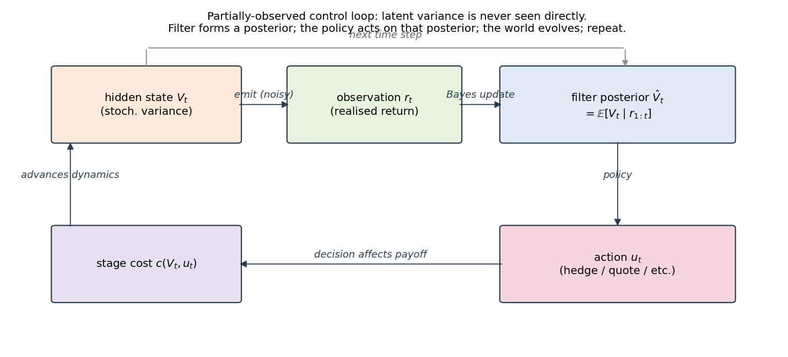
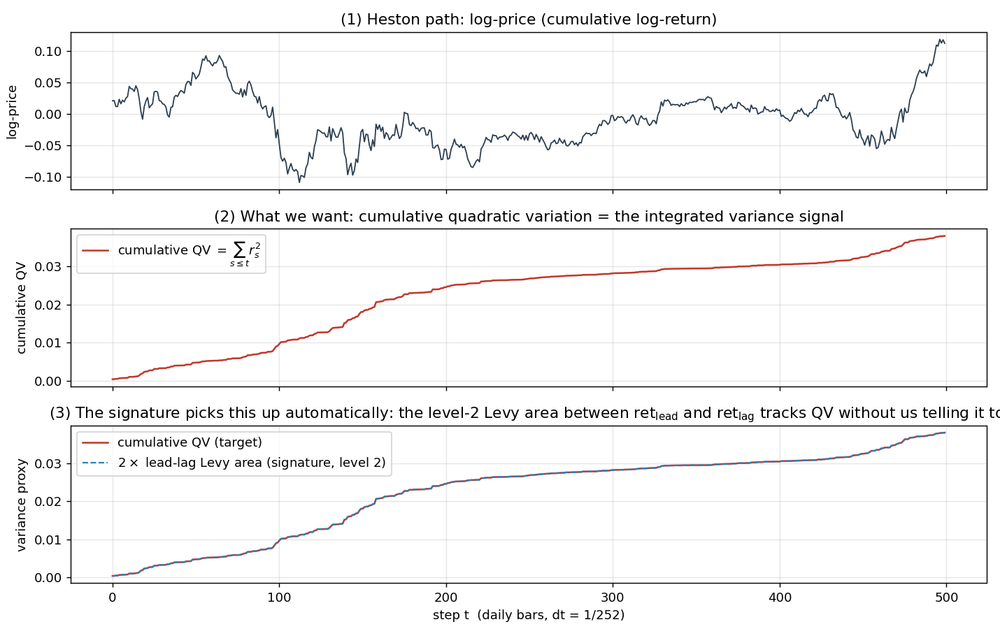
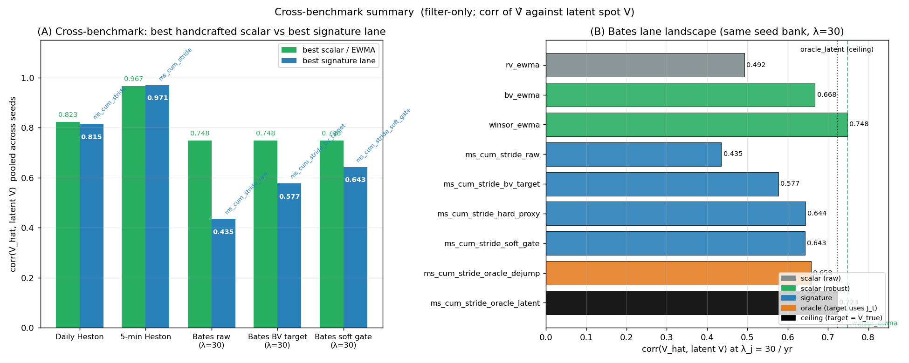

# POMDP-Koopman-Control — Project Retrospective

**For:** Jose (macro-quant at BoA — vol-swap familiarity, not signatures)

**Goal of this deck:** explain (i) the question, (ii) the math machinery, and (iii) the **complete catalogue** of methods we have built — both the **filter side** (estimate latent V) and the **control side** (act on V̂).

**One-line summary of the project.**
We are building a partially-observed-control toolkit where a **model-free path-feature representation (signatures)** plays the role of a "universal" volatility filter, AND a **local-quadratic value-gradient controller** decides actions on top of whichever filter is selected.

**Project umbrella ("Koopman") in one line.** The broader research line uses *Koopman operators* — linear operators on observable functions of the state — to derive things like variance-swap prices and value functions from the SDE generator without re-solving a PDE. This deck mostly focuses on the filter+control pipeline; Koopman shows up briefly on the lane-taxonomy slide (older `bayesian_sig` filter and older Koopman-growth-rate control work).

---

## The economic question

A vol-swap with maturity T pays the realized integrated variance
$\int_0^T V_t\,dt$ (less a fixed strike). To **price**, **hedge**, or **trade around it** you need:

1. an estimate of the *current* hidden $V_t$,
2. its dynamics under your chosen measure,
3. the conditional expectation $\mathbb{E}\!\left[\int_t^T V_s\,ds \mid \mathcal{F}_t\right]$,
4. **a policy that acts on those estimates** — hedge ratio, allocation, market-making spread, etc.

(1)–(3) are filtering. (4) is **control under partial observation**. Both halves are studied in this project. The deck walks through both.

Same machinery applies to: option market-making (Avellaneda–Stoikov), portfolio choice with stochastic vol (Merton–Heston), variance-arb risk management. $\mathcal{F}_t$ = filtration / information observable up to time $t$.

---

## Notation primer (reference)

**Probability & filtering**

| Symbol / abbr | Meaning |
|---|---|
| **POMDP** | Partially-Observed Markov Decision Process: control problem where the state is hidden behind noisy observations |
| **SDE** | Stochastic Differential Equation (e.g. $dX_t = \mu\,dt + \sigma\,dW_t$) |
| $\mathcal{F}_t$ | Filtration: information available up to time $t$ |
| **KF** / Kalman | Classical recursive Bayesian filter for linear Gaussian state-space models |
| **BLR** | Bayesian Linear Regression (conjugate Normal-Inverse-Gamma posterior) |

**Volatility models & estimators**

| Symbol / abbr | Meaning |
|---|---|
| **CIR** | Cox-Ingersoll-Ross dynamics: $dV = \kappa(\theta-V)\,dt + \xi\sqrt{V}\,dW$ — Heston's variance process |
| **CEV** | Constant-Elasticity-of-Variance: $dS = \mu S\,dt + \sigma S^{\beta}\,dW$ — *misspecified* dynamics relative to Heston in our tests |
| **QV** | Quadratic variation $\sum_{s\le t} r_s^2$; integrated-variance proxy on a discretized path |
| **EWMA / BV / winsorize** | Exponentially-weighted MA / bipower variation $(\pi/2)\,\lvert r_{t-1}\rvert\,\lvert r_t\rvert/\Delta t$ / clip at $k\cdot s$ |

---

## Notation Primer (continued)
**Signatures**

| Term | Meaning |
|---|---|
| **Lévy area** | For paths $X, Y$: $\tfrac{1}{2}\!\int (X\,dY - Y\,dX)$; antisymmetric level-2 signature feature |
| **Chen's identity** | Sig multiplicativity $\mathrm{sig}(X \ast Y) = \mathrm{sig}(X) \otimes \mathrm{sig}(Y)$. Lets us recover window log-sigs from a cumulative one |
| **BLF / CdC** | Bayesian Latent Filter / Cesàro-averaged conditional drift (Koopman identity for $\mu, \sigma^2$); legacy `bayesian_sig` lane |

**Control & evaluation**

| Symbol / abbr | Meaning |
|---|---|
| **CRRA** | Constant Relative Risk Aversion utility $U(W) = W^{1-\gamma}/(1-\gamma)$, parameter $\gamma > 0$ |
| $\pi_t$ / $u_t$ | Risky allocation at $t$ / scalar overlay $u_t \in [-u_{\max}, u_{\max}]$ |
| $\pi_{\text{ref}}(V)$ | Myopic Merton reference $(\mu - r)/(\gamma V)$ |
| **Advantage** $A(z, u)$ | $Q(z, u) - Q(z, u_{\text{ref}})$ — gain over the reference policy at state $z$ |
| **CRN** | Common Random Numbers: same Brownian path drives both policies in a paired comparison |
| **CE** | Certainty-equivalent wealth $\big(\mathbb{E}[W^{1-\gamma}]\big)^{1/(1-\gamma)}$ — primary CRRA metric |

---

## The setting: a partially-observed control loop

- Hidden state $V_t$ (variance) follows a known *or* unknown SDE.
- Observation $r_t$ = realized return; Brownian-driven, scaled by $\sqrt{V_t}$.
- Filter forms posterior $\hat V_t = \mathbb{E}[V_t \mid r_{1:t}]$.
- Policy $u_t = \pi(\hat V_t, t)$ — acts on the filter posterior.
- Cost / reward $c(V_t, u_t)$ feeds back into the next state.

A **POMDP** is the formal setting. The full problem is: choose policy $\pi(\cdot)$ to maximize $\mathbb{E}\!\left[U(W_T)\right]$ given that $V_t$ is never observed directly.

---

## Why filtering volatility is hard

The "obvious" estimator under no jumps:
$$\widehat V_t \approx r_t^2 / \Delta t.$$

But $r_t = \sqrt{V_t \Delta t}\,Z_t$ with $Z_t \sim \mathcal{N}(0,1)$, so
$$r_t^2 / \Delta t = V_t \cdot Z_t^2, \quad \mathbb{E}[\cdot] = V_t, \quad \mathbb{V}\text{ar}[\cdot] = 2 V_t^2.$$

A **single observation is chi-squared-noisy** around V_t (since $Z_t^2 \sim \chi^2_1$). You cannot avoid smoothing — across time (EWMA), across scales (multiresolution), or across path features (signatures).

Add jumps and even smoothing breaks: a single jump atom inflates $r_t^2$ by orders of magnitude. That's the Bates story later.

---

## Test bed: Heston + Bates + (later) CEV misspecification

**Heston** (continuous SV):
$$dS_t = \mu S_t\,dt + S_t\sqrt{V_t}\,dW^{(1)}_t,\;\;dV_t = \kappa(\theta - V_t)\,dt + \xi\sqrt{V_t}\,dW^{(2)}_t,\;\;d\langle W^{(1)}, W^{(2)}\rangle_t = \rho\,dt.$$

**Parameters.** $\kappa$ = mean-reversion speed; $\theta$ = long-run variance level; $\xi$ = vol-of-vol; $\rho$ = leverage correlation.
Defaults: κ=2, θ=0.04 (≈20% annualized vol), ξ=0.3, ρ=−0.7, dt=1/252. Half-life $1/\kappa \approx 0.5$ yr.

**Bates** = Heston + compound-Poisson jumps in log-price:
$dS_t/S_t = \dots + (e^{J_t}-1)\,dN_t,$ with $N_t \sim \text{Poisson}(\lambda_j),\,J_t \sim \mathcal{N}(\mu_j, \sigma_j^2)$.

For the misspecification studies we additionally use **CEV** ($\sigma S^\beta$) — the filter is fit assuming Heston/CIR, but the data is generated under CEV. Used in the Level-4 control result a few slides down.

---

## The actual control problem

We do not just estimate $V_t$ — we **act** on $\hat V_t$.

**Action format (our standing convention).** Multiplicative overlay over a known-good reference policy:
$$\pi_t = (1 + u_t)\,\pi_{\text{ref}}(\hat V_t),\quad u_t \in [-u_{\max},\, u_{\max}].$$

- $\pi_{\text{ref}}(V) = (\mu - r)/(\gamma V)$ — the **myopic Merton allocation** under known V; one-step optimal under log-utility.
- $u_t$ is the *correction* we fit. Setting $u_t \equiv 0$ recovers myopic Merton at the filter's posterior — the natural reference policy.

**Why this form.** (1) Trust-region constraint built in. (2) Reference is non-trivial, so failure modes show as $u_t$ oscillation, not allocation-collapse. (3) Single scalar action keeps the stage Hamiltonian quadratic and fittable from short rollouts.

**Objective.** Terminal CRRA utility $\mathbb{E}\!\left[W_T^{1-\gamma}/(1-\gamma)\right]$. Reported as certainty-equivalent (CE) or paired $\Delta\,\log W_T$ vs the reference.

---

## Three control routes we have built

| Route | What it does | Where it lives |
|---|---|---|
| **Local value-gradient** *(current preferred)* | Fit a control-quadratic transition $\mathbb{E}[\psi_{t+1}\mid\psi_t,u]\approx (A_0 + uA_1 + u^2A_2)\,\psi_t$, then backward-recurse the value function. Decision-time Hamiltonian is exactly quadratic in $u$: $u^* = -\alpha_1/(2\alpha_2)$ with abstention if $\alpha_2 \ge 0$. | `src/control/local_value_gradient.py`, `finance/experiments/merton_value_gradient.py` |
| **SDRE + Itô-quadratic** *(Level-4 sanity check)* | Skip regression entirely. Use Itô expansion of $\Delta U$: $\mathbb{E}[\Delta U] = a + b\,\pi + c\,\pi^2$ with $b = U'\,W(\hat\mu - r),\; c = \tfrac{1}{2}U''\,W^2\,\hat V$. One-step-optimal $\pi^* = -b/(2c)$. | `kronic_pomdp/experiments/graduated_sanity_checks.py`, Level 4 |
| **Residual-kernel / Bayesian local-quadratic** | Kernel-ridge or Bayesian linear regression on (state, action) → value-increment. Posterior mean is the fitted advantage; posterior covariance is its uncertainty. | `src/control/kernel_residual_control.py`, `bayesian_local_quadratic.py` |

All three share the multiplicative overlay; they differ in **how the policy is extracted from data** (regression-vs-Itô-vs-kernel).

---

## Past result: adapting under model misspecification key finding

Graduated-sanity-checks Level 4 (5 macro seeds, paired CRN, daily Heston-vs-CEV):

| Setting | Filter | $\hat V$ corr | $\hat\pi$ corr |
|---|---|---|---|
| Heston (correct model) | Kalman (true CIR) | +0.68 ± 0.10 | — |
| Heston (correct model) | **BLR + KF lead-lag (model-free)** | **+0.78 ± 0.04** | — |
| **CEV (misspecified)** | Kalman (assumed CIR; *wrong*) | +0.63 | +0.74 |
| **CEV (misspecified)** | **BLR + KF lead-lag (model-free)** | **+0.77** | **+0.91** |

**Reading.** When dynamics are *correct*, the model-free signature lane is already competitive with the known-model Kalman. When dynamics are *wrong* (CEV instead of Heston), the Kalman degrades and the signature lane essentially **holds**. This is exactly the "signatures earn their keep when the model is wrong" prediction.

**The mechanism (the channel of adaptation):** the signature lane has **no structural commitment to CIR** — its filter target is just $\mathbb{E}[r_t^2/\Delta t \mid V_t] = V_t$, which holds for *any* continuous diffusion. The local-value-gradient controller has **no structural commitment to CIR either** — the $A_0 + uA_1 + u^2A_2$ transition is *fit empirically* from rollouts. The Kalman lane embeds CIR in **both** the prediction step and the heteroskedastic R_t. So under CEV the signature stack is structurally indifferent; the Kalman stack is structurally committed and biased.

Source: `kronic_pomdp/experiments/graduated_sanity_checks.py` + `MEMORY.md`.

---

## How we evaluate held-out

**Standing protocol.** Across all benchmarks (current and past):

1. **Train/test split** on disjoint seed banks.
2. **Paired evaluation under common random numbers (CRN).** Same Brownian path drives both the candidate policy and the reference (myopic at $u=0$). Variance reduction is huge — paired $\Delta\,\log W_T$ is the right quantity.
3. **CRRA score** as primary aggregator: $\text{score} = \mathbb{E}[\Delta\log W_T] - \tfrac{1}{2}(\gamma-1)\,\mathbb{V}\text{ar}[\Delta\log W_T]$.
4. **Bootstrap 5 / 95%** intervals over seeds.
5. **Filter-side audit reported alongside.** RMSE / corr of $\hat V$ vs latent $V$.

**Reference benchmark.** Honest-benchmark trilogy (`kronic_pomdp/experiments/honest_benchmark.py`): Oracle / BPF+Myopic / EWMA+Myopic / SigRidge+Myopic / Constant. Oracle-to-Constant CE gap ≈ **1%** at daily frequency — filtering value is *small* at this regime; BPF captures ~50% of it, EWMA ~30%.

**What this protocol is and isn't.** Solid for offline / final evaluation. **Not** real-time. We come back to that gap later.

---

## Three families of variance estimator

| Family | What it is | Strength | Weakness |
|---|---|---|---|
| **Scalar smoother** | EWMA of $r_t^2/\Delta t$ (or BV, or winsorized $r_t^2$) | cheap, near-sufficient when V is the only latent | jump-fragile if you don't pick the right local proxy |
| **Classical filter** | Kalman / heteroskedastic Kalman / particle filter on a *posited* state-space model | optimal under correct model | needs known dynamics; fails under misspecification |
| **Signature-based** | BLR (Bayesian linear regression) on lead-lag log-signature features of the path | model-free; carries a universal-approximation guarantee | finite-sample variance; needs the right *target* |

Our project's premise: **when the cheap scalar summary works, use it; when it doesn't, signatures are the principled fallback.** This is the "gated state compression" thesis we'll come back to.

---

## What is a signature, intuitively?

A *signature* is to a path what *cumulants* are to a probability distribution.

| Signature level | Object | Analogous to |
|---|---|---|
| 0 | constant 1 | normalization |
| 1 | path increments $\int dX$ | mean |
| 2 | iterated integrals $\iint dX\,dY$ (incl. **Lévy area**) | covariance / "twist" |
| 3 | triple integrals | skew |

**Universal approximation.** Any continuous functional of a path can be approximated arbitrarily well by a *linear* function of a deep-enough signature (Lyons, Chevyrev–Kormilitzin, Fermanian).

For variance filtering we use level 2: it has *exactly* the right structure to encode quadratic variation. Next slide shows this empirically.

---

## Lead-lag Lévy area ≈ realized variance

**Lead-lag transform.** Take the (time, return) path and duplicate it as `(time_lead, ret_lead, time_lag, ret_lag)` with a half-step shift. The level-2 antisymmetric Lévy area between `ret_lead` and `ret_lag` satisfies

$$2 \cdot \text{LévyArea}(\text{lead}, \text{lag}) \approx \sum_{s \leq t} r_s^2 = \text{cumulative QV}.$$

The signature picks up integrated variance **automatically**, without us telling it to. This is why the level-2 lead-lag log-sig is the canonical signature feature for vol filtering.

---

## Multiresolution signatures

A single signature window has one "memory length." Volatility lives across multiple timescales. Two ways to make signatures multi-scale:

- **Forgetting-factor ladder.** Run K parallel sig states with different decay $\gamma_k = \exp(-\Delta t/\tau_k)$ and combine via posterior precision-weighting.
- **Cumulative + stride snapshots + Chen-level-2 recovery** *(our preferred design).* Maintain ONE cumulative log-signature; at each step recover the signature of the window $[t-m, t]$ exactly at level 2 using **Chen's identity** (signature of a concatenated path = tensor product of pieces; rearranged):
  $$a_2^{\text{win}} = a_2^{\text{now}} - a_2^{\text{past}} - \tfrac{1}{2}\,[\,a_1^{\text{past}},\, a_1^{\text{now}}\,].$$

The cumulative-stride design has lower memory and beats forgetting-factor fusion empirically.

---

## Lane taxonomy: filter + control combinations

**Filter lanes (what produces $\hat V$):**

| Lane | Family |
|---|---|
| `ewma`, `winsor_ewma`, `bv_ewma` | scalar smoother |
| `hetero_kalman` | classical filter (known CIR) |
| `bayesian_sig` (DualTargetBLF) | signature, dual-target (CdC / Koopman background) |
| `blr_kf_leadlag` | signature, single-scale (γ=0.99, 3-feature BLR + outer Kalman) |
| `ms_forget_fixed` / `ms_forget_spectral` | multi-scale signature, γ-ladder |
| `ms_cum_stride` | multi-scale signature, cumulative + Chen recovery — preferred |

**Control architectures (what produces $u_t^*$):** local-value-gradient (paired-noise rollouts + backward DP); SDRE + Itô-quadratic (one-step Hamiltonian); residual-kernel / Bayesian-local-quadratic (KRR or BLR on advantages).

**Bates-specific target variants:** `*_bv_target`, `*_hard_proxy`, `*_soft_gate`, `*_oracle_dejump`, `*_oracle_latent`. These re-target the **same** signature lane against different supervised signals.

---

## Result 1: Daily Heston easy case

**Setup.** 80 seeds × 200 steps, dt=1/252, filter-only, post-update V̂ vs spot V_t.

| Lane | corr(spot V) |
|---|---|
| **ewma (halflife 21d)** | **+0.8229** |
| ms_cum_stride (1/5/20d) | +0.8149 |
| bayesian_sig | +0.7710 |
| ms_forget_spectral | +0.7667 |
| blr_kf_leadlag (γ=0.99) | +0.7571 |
| ms_forget_fixed | +0.6829 |

**Verdict.** Gate stays with EWMA. *But:* the architectural gradient *within* signatures is sharp — `ms_cum_stride` beats `ms_forget_fixed` by **+0.132 corr**. The cumulative-stride design clearly wins among signature variants.

Source: `study_heston_multiscale_signature_filters.py`. corr = Pearson correlation of post-update $\hat V_t$ vs latent $V_t$, pooled across seeds.

---

## Result 2: 5-minute Heston competitive tie

**Setup.** 8 seeds × 60 trading days × 78 bars/day, dt=1/(252·78), filter-only.

| Lane | corr(spot V) | RMSE |
|---|---|---:|
| **ms_cum_stride** | **+0.9705** | **0.0050** |
| ewma_5min_1d (halflife 78b) | +0.9668 | 0.0053 |
| ewma_5min_5d (halflife 390b) | +0.9597 | 0.0058 |
| ms_forget_spec (13/53/210d) | +0.9252 | 0.0080 |
| blr_kf_leadlag | +0.9088 | 0.0088 |

**Verdict.** Signature *edges out* EWMA on point estimate (Δ = +0.0037 corr, **below** the +0.03 pre-registered flip bar). Warm-start ablation confirms the residual gap is intrinsic, not cold-start. **Tied.**

RMSE = root mean squared error of $\hat V_t - V_t$. Source: `study_heston_5min_signature_filters.py`.

---

## Result 3a: Bates with raw `r²/Δt` gate flips

**Setup.** 40 seeds × T=400, dt=1/252, λ_j=30/yr, μ_j=−0.03, σ_j=0.03.

| Lane | corr(all) | corr(jump-adjacent) |
|---|---|---|
| **winsor_ewma** | **+0.7479** | **+0.7471** |
| bv_ewma (bipower) | +0.6678 | +0.6648 |
| rv_ewma (plain `r²/Δt`) | +0.4923 | +0.4859 |
| ms_cum_stride_raw | +0.4352 | +0.4086 |
| ms_cum_stride_bv_target | +0.5768 | +0.5767 |

**Verdict.** Plain `r²/Δt` collapses (+0.49). Robust scalar — winsorized EWMA — wins. Naive signature lane *also* collapses because its BLR target is `r²/Δt`. **The gate flips, but to a robust handcrafted scalar, not to signatures.**

"jump-adjacent" = steps within ±5 bars of any simulated jump event. Source: `study_bates_lambda_sweep.py` at λ=30.

---

## Result 3b: Bates with target-swap recovery

Replace the signature lane's BLR target from `r²/Δt` to per-step bipower variation
$\text{BV}_t = (\pi/2)\,|r_{t-1}|\,|r_t|/\Delta t$. Architecture unchanged.

| Lane | corr(all) | corr(jump) |
|---|---|---|
| winsor_ewma | +0.7479 | +0.7471 |
| ms_cum_stride_bv_target | +0.5768 | +0.5767 |
| ms_cum_stride_raw | +0.4352 | +0.4086 |

Recovery: **+0.142 corr overall, +0.168 jump-adjacent**. Closes about **58% of the raw→winsor gap**. The signature *features* already contain the information; the BLR was being trained on the wrong target.

**Bates failure was primarily a target problem, not a representation problem.**

Source: `study_bates_signature_proxy_channels.py`.

---

## Result 3c: Bates λ-sweep + corrected oracle decomposition

Same seed bank, λ ∈ {10, 30, 60}/yr. Three new lanes added on top of `bv_target`:

- `hard_proxy` — winsor-style target $\min(r^2/\Delta t, \text{BV}_{\text{smooth}})$.
- `soft_gate` — target with online posterior-like jump gate $q_t = 1 - e^{-z_t}$.
- `oracle_dejump` — target $(r_t - J_t)^2 / \Delta t$ (uses true jump atom; not deployable).
- `oracle_latent` — target = $V_t$ (perfect supervision; **unattainable ceiling**).

**Residual decomposition at λ=30 (corr, all-samples):**

| Piece | Size |
|---|---:|
| jump identification (oracle_dejump − soft_gate) | +0.015 |
| per-step target noise (oracle_latent − oracle_dejump) | **+0.064** |
| sig structural deficit (winsor_ewma − oracle_latent) | +0.025 |

**Per-step chi-squared noise dominates.** Jump identification is *not* the bottleneck. Soft gating ≈ hard clip. Source: `study_bates_target_gating_lambda_sweep.py`.

---

## Cross-benchmark summary

**Read the figure.**
- Left panel: best handcrafted scalar (green) vs best signature lane (blue) at each benchmark. The gap is small everywhere; it widens only when we feed signatures the wrong target (Bates raw).
- Right panel: at λ=30 Bates, all signature variants vs scalar baselines, with the unattainable `oracle_latent` ceiling marked. Even with perfect supervision, the signature representation **matches** `winsor_ewma` here — confirming the architecture is fine.

**At every config we ran, the binding constraint is target supervision and per-step chi-squared noise, not the signature representation.**

---

## Synthesis: gated state compression

**Decision rule.**
*Use the cheapest summary–target pair that passes calibration and closes most of the control-relevant gap. Escalate to signatures only when (i) the cheap summary is unavailable or misspecified, OR (ii) you cannot produce a trustworthy target for it.*

**Three checks.**
1. **Structural admissibility** — can the summary be read as a sufficient statistic for the continuation value?
2. **Empirical sufficiency** — held-out gap small relative to the noise floor.
3. **Calibration** — posterior coverage / z-scores acceptable.

If any of (1)–(3) fails, escalate. Bates teaches the *summary–target pair* refinement; the past CEV result shows that **when (1) fails because the dynamics are mis-specified, signatures are the practical fallback**.

Full statement: `docs/gated_compression_note.md`. Validation ladder: `docs/benchmark_ladder_gated_compression.md`.

---

## What we DON'T have yet — real-time regret / advantage tracking

**The current evaluation pipeline is offline / paired CRN.** It tells us, post-hoc, *did the policy beat the reference at horizon T?* It does **not** tell us:
- per-step posterior advantage $\hat A_t = \alpha_1(z_t)\,u_t^* + \alpha_2(z_t)\,u_t^{*2}$ (Hamiltonian residual over abstain $u=0$),
- credible interval on $\hat A_t$ from the BLR posterior over $A_2(t)$,
- cumulative paired-PnL vs reference, **as it accrues**,
- a streaming "is the controller helping or hurting right now?" signal.

**The pieces are already there.** The local-value-gradient model already produces $\alpha_0, \alpha_1, \alpha_2$ per step at decision time. Wrapping these into an online dashboard is a **small** add: no architecture change, no new theory.

**Concrete proposal.** A streaming layer on `merton_value_gradient.py` that exposes per step $\{\hat V_t,\;\text{V CI},\; u_t^*,\; \hat A_t,\;\sigma_t^A,\;\text{cum-PnL vs reference}\}$, plus a paired-Sharpe / running-CRRA estimator with a fixed-window bootstrap. Useful for: live monitoring, regret-vs-reference tracking, and *eventually* online policy-switching between filter–controller pairs.

---

## Bottom line + open questions

**Bottom line.**
- Daily / 5-min Heston: handcrafted scalars win or tie at the filter-quality level. **Signatures cannot beat their finite-sample variance cost when a near-sufficient scalar exists.**
- Bates: filter gate flips, but to a *better scalar*. After target correction, signature lane recovers most of the gap; remaining residual is **per-step chi-squared noise**.
- **CEV / model misspecification:** the historical Level-4 result shows the signature stack *holds* while a known-model Kalman *degrades*. This is the strongest control-side evidence for the project, and the channel of adaptation is **structural model-freeness in BOTH the filter target and the controller's transition model**.
- The architectural finding `cumulative-stride + Chen-level-2 + spectral ladder` is robust across configs.

**Open program.**
1. **Window-aggregated targets** to attack the per-step noise floor.
2. **Real-time regret/advantage tracker** on top of the existing value-gradient controller (previous slide).
3. **Joint filter+controller revisit on misspecified dynamics** (CEV, two-factor SV, regime-switch Bates) — leveraging the structural-indifference channel; the next benchmarks where the gate is predicted to flip toward signatures.
