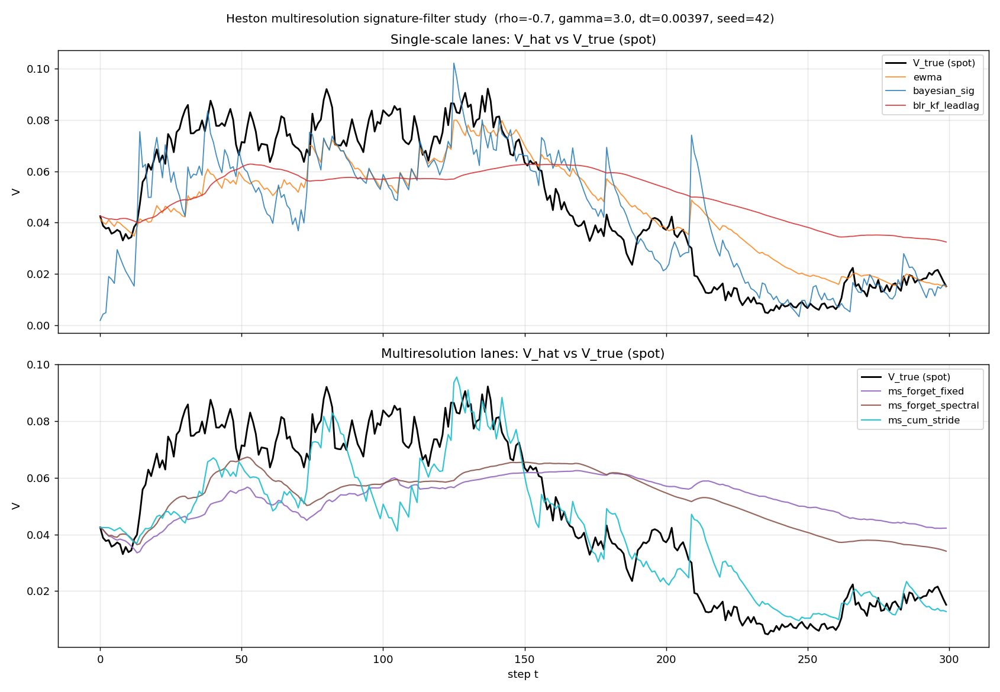

# Gated State Compression for Partially Observed Control

**Thesis in one sentence.**
Use the cheapest *structurally admissible* state summary first; escalate to signature-based path compression only when the summary is unavailable, misspecified, or leaves path-dependent residual structure.

 

**What this deck delivers.**
1. **Completed evidence.** On daily Heston, a scalar smoother (EWMA) matches or beats every signature lane.
2. **Architectural lesson.** The right model-free signature design — cumulative lead-lag + stride snapshots + Chen-level-2 recovery — emerges clearly from the multiresolution study, *within* the signature family.
3. **Thesis claim.** A precise gate that picks between summary-target pairs using calibration + control-relevant performance.
4. **Validation ladder.** Completed daily / intraday / jump studies, plus the remaining hard-case program.

Completed evidence now covers: daily Heston, 5-minute Heston, and Bates jump-volatility. Remaining ladder rows in Slide 4 are still proposed program items, not run.

---

## Slide 1 — Daily Heston identifies an easy-case gate

**Setup.** 80 seeds × 200 steps, u=0, warm-up 20. Post-update V̂ vs spot V_t; corr and RMSE pooled across seeds. Filters consume dr_S (underlying-asset return), not wealth return.

| Lane | Class | corr(spot V) | corr(fwd_lat_V, h=10) |
|------|-------|--------------|------------------------|
| **ewma (halflife 21d)** | scalar smoother | **+0.8229** | +0.7925 |
| ms_cum_stride (1/5/20d) | multires signature | +0.8149 | +0.7816 |
| bayesian_sig (DualTargetBLF) | signature BLF | +0.7710 | +0.7504 |
| ms_forget_spectral (13/53/210d) | multires signature | +0.7667 | +0.7420 |
| blr_kf_leadlag (γ=0.99) | single-scale signature | +0.7571 | +0.7342 |
| ms_forget_fixed (1/5/20d) | multires signature | +0.6829 | +0.6626 |

**On vanilla daily Heston, signatures do not beat the best handcrafted scalar smoother.**
**This identifies daily Heston as an easy-case gate** — a cheap scalar variance smoother is close to sufficient for V-tracking at this config. An honest, reproducible result, not a failure to explain away.

Source: `finance/experiments/study_heston_multiscale_signature_filters.py`. Status: **completed**.

---

## Slide 2 — What the signature study actually taught us

**Architectural gradient (corr spot V, same study).**

- `ms_cum_stride` > `blr_kf_leadlag` by **+0.058**
- `ms_cum_stride` > `ms_forget_fixed` by **+0.132**
- `ms_forget_spectral` > `ms_forget_fixed` by **+0.084**
- `ms_cum_stride` sits only **0.008** below EWMA

**Takeaway.**
The contribution is **not** "signatures win everywhere." It is that, *among signature variants*, the right model-free path-compression design is:

**cumulative lead-lag + stride snapshots + Chen-level-2 window recovery.**

This design beats naive forgetting-factor fusion materially, and it nearly matches the handcrafted scalar baseline **without knowing the scalar structure in advance**. That gives us a reusable signature lane for harder environments where the scalar summary is absent, misspecified, or untrustworthy.

Source: `src/sskf/multiscale_leadlag_filters.py` (`CumulativeStrideLeadLagBLRKFilter`). Status: **completed**.

---

## Slide 3 — Thesis: Gated State Compression

**Decision rule (the gate).**
*Default to the simplest summary that passes calibration and closes most of the control-relevant gap.*

**Refinement from the Bates study.**
The gate acts on a **summary-target pair**, not on representation alone. A strong path representation can still fail if it is supervised against the wrong local characteristic.

**Three-step logic.**

1. **Cheapest structurally admissible summary first.** If a low-dimensional summary is structurally admissible *and* empirically sufficient, use it.
   *Example:* EWMA on daily Heston.
2. **Escalate on failure.** If that summary-target pair is unavailable, misspecified, or leaves residual path dependence, escalate to **signature-based compression** (cumulative lead-lag + stride + Chen-level-2) with a target matched to the latent characteristic of interest.
3. **Pick with diagnostics.** Choose between summaries using **filter calibration** (coverage, z-scores) and **control-relevant held-out performance** (paired CRRA score; not just filter correlation).

**Structurally admissible (definition).** A summary is *structurally admissible* if it can be interpreted as an approximate Bayesian filter state or sufficient statistic for the continuation value under the chosen control objective.

**Why the signature machinery still matters.** Unknown observation law; irregular sampling; multifactor / path-dependent latent structure; transfer across environments where the right handcrafted statistic is not known a priori.

---

## Slide 4 — Validation ladder: completed rows and next flips

**This is a mixed results/program slide.** Rows 1–3 are now completed studies; rows 4–6 are the remaining hard-case program.

| # | Benchmark | Why simple summary may fail | Simple baseline | Model-free lane | Outcome / gate | Status |
|---|---|---|---|---|---|---|
| 1 | Daily Heston, daily bars | Mostly doesn't; well-specified easy case | EWMA on dr_S²/dt | ms_cum_stride | Gate chooses EWMA. **Confirmed.** | completed |
| 2 | Heston, 5-min bars | Stronger separation of timescales; multiscale vol; intraday pattern | EWMA / realized-variance EWMA | ms_cum_stride; multiscale lead-lag BLR | No flip. `ms_cum_stride` is competitive (`0.9705` vs `0.9668` corr), but warm-start says the residual gap is intrinsic. | completed |
| 3 | Bates / jump-vol | Jumps contaminate 1-D variance proxies | winsorized or BV-style EWMA | multires cumulative-stride signature | Raw `r²/dt` flips gate to robust scalar; BV-target swap recovers ~58% of the raw→winsor gap. Soft gate ≈ hard clip; corrected de-jump oracle adds only ~0.02 corr, while latent-target supervision adds ~0.06 to ~0.09. Residual is mainly target noise at this config. | completed |
| 4 | Nonlinear-observation latent state | No linear/Gaussian sufficient statistic | Kalman or handcrafted proxy | signature compression | Gate should prefer signatures | next |
| 5 | Irregular / missing samples | Fixed-clock smoother structurally awkward | Interpolation + EWMA, or event-time EWMA | signature path summary | Signatures more attractive | planned |
| 6 | Multifactor / two-timescale latent | One scalar cannot summarize multiple factors | Scalar EWMA, low-order parametric filter | multiresolution signatures | Signature lane more likely to win | later |

**The thesis is not that signatures dominate on every benchmark; it is that the gate identifies when simple summaries are enough and when richer model-free compression is warranted.**

Key Bates refinement: the signature lane means architecture + target. Same `ms_cum_stride` state with a BV-style target lifts corr from `0.5226` to `0.6997`; a corrected de-jump oracle is only ~`+0.02` above the soft-gated target on jump windows, while latent-target supervision adds `+0.05` to `+0.09`. `winsor_ewma` remains best at current jump intensities. Full benchmark details: `docs/benchmark_ladder_gated_compression.md`.

---

## Appendix — Prior evidence from sibling repos

**Label: prior, not rerun in this pass. Use as directional evidence only.**

- **Heston signature-filter line (older repo).** The `graduated_sanity_checks.py` lineage in `kronic_pomdp/` (lead-lag log-sig + RLS, γ=0.99) recorded **V_corr ≈ 0.76** on Heston — the strongest memory-supported signature result in the prior repo. That number motivated the revived BLR+KF lane here; our daily-Heston run reproduces the *class* of behavior (signatures close to but not above the scalar baseline). Caveat: different estimator and evaluation protocol.
- **Hida / Malliavin / signature equivalence framing.** `docs/hida_malliavin_signature_unification.md` develops the formal statement that signature iterated integrals coincide with the Wiener-chaos basis up to a change of basis. This is the theoretical grounding for Proposition 2 of the companion note: signatures are a *universal* approximation class for continuous path functionals under mild regularity.
- **Multiresolution transfer evidence (sibling pricing repo).** `../koopman-pricing/experiments/multiscale_pricing_benchmark.py` and `hf_panel_transfer_benchmark.py` show that spectral-principled timescale selection meaningfully changes pricing accuracy at 5-min bars. This is our directional prior that Row 2 of the ladder is *not* a foregone conclusion for EWMA.

None of these substitute for the planned benchmarks on Slide 4. They shape prior, not posterior.
