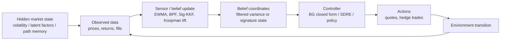
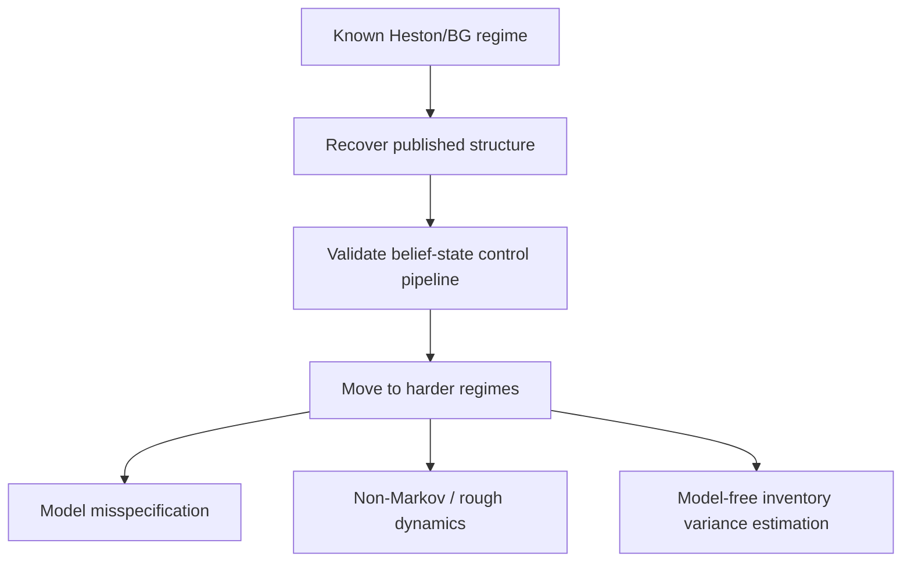
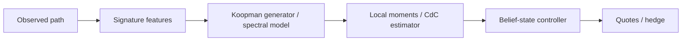
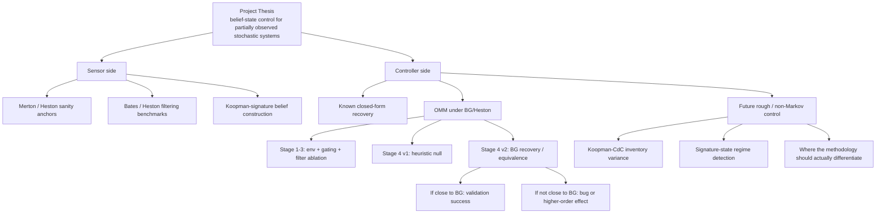
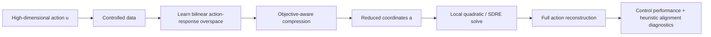
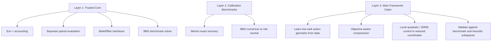

# Theory Map

Current theory map for the repo as it actually stands on 2026-04-10.

This document is not a proposal. It is a status map:

- what the project is trying to show,
- what is already established,
- what is mostly infrastructure and benchmark discipline,
- what remains genuinely open.

## One-paragraph summary

The core thesis of the repo is a **belief-state control architecture for partially observed stochastic systems**: learn or estimate a low-dimensional state from observations, then control in that state. In the repo's strongest form, that state is built from **Koopman/signature observables**. In the current OMM line, however, the Heston/Bergault-Guéant stage is primarily a **validation benchmark**, not the final theory destination: the right success case is to recover a known analytic structure under partial observation, not to beat it. The more ambitious claim, still open, is that the same architecture matters once the dynamics are non-Markov, misspecified, or otherwise outside the closed-form BG regime.

## 0.1 The Three-Route Theory Stack

The repo is now best understood through three complementary theory routes.

1. **Approach I — factor-reduced / homothetic control**
   - exact benchmark route when scale invariance closes the problem on a latent
     factor;
   - detailed note: [theory_crra_eigenfunction.md](/home/ed/SynologyDrive/Documents/Research/PE_Research/pomdp-koopman-control/docs/theory_crra_eigenfunction.md:1)

2. **Approach II — stationary transformed-state control**
   - general representation route when raw price/wealth levels are non-ergodic
     but a transformed path state can be made stationary;
   - detailed note: [theory_ergodic_signatures_and_horizon_selection.md](/home/ed/SynologyDrive/Documents/Research/PE_Research/pomdp-koopman-control/docs/theory_ergodic_signatures_and_horizon_selection.md:1)

3. **Approach III — finite-horizon local semigroup control**
   - the long-run control route, replacing invariant-measure logic by
     short-horizon local generator expansions around a reference controller;
   - synthesis note: [signature_based_filtering_control.md](/home/ed/SynologyDrive/Documents/Research/PE_Research/pomdp-koopman-control/docs/signature_based_filtering_control.md:1)

Current recommended order:

- use Approach I for clean validation,
- build reusable tooling around Approach II,
- and treat Approach III as the fully general controller theory to complete
  once the representation layer is stable.

## 1. Core thesis

At the project level, the intended theory is:

1. A partially observed stochastic control problem can be treated as a control problem on a learned or filtered belief state.
2. Koopman/signature coordinates are a viable way to build that belief state from path data.
3. Once the belief state is in hand, the controller can be simple, local, and low-dimensional.
4. The value of the machinery is largest when the hidden dynamics are hard to model directly.

In symbols, the intended architecture is:

For the repo as it exists today, that breaks into two theory layers:

- **Sensor layer**: online estimation of hidden state from observations.
- **Controller layer**: map filtered state into an action that is interpretable and testable.

## 2. What is already established

### 2.1 Merton recovery

The cleanest theoretical anchor in the finance folder is still the Merton validation: when the problem has a known closed-form optimum, the control framework should recover it exactly. That is the right standard for trust. This repo already has that kind of exact-recovery benchmark in [merton_validation.py](/home/ed/SynologyDrive/Documents/Research/PE_Research/pomdp-koopman-control/finance/experiments/merton_validation.py).

Interpretation:

- this is not the final contribution,
- but it proves the repo is willing to hold itself to exact-recovery standards,
- which is the right norm for the OMM program too.

### 2.2 Filtering works without full model knowledge

The Heston/Bates line already supports a real sensor-side claim:

- signature / operator-style filters can approach particle-filter quality,
- with much lower runtime cost and much less model knowledge.

That is the strongest existing empirical result in the repo's native methodological lane. It says the **belief-state construction is not fake**.

### 2.3 OMM Stages 1-3 are benchmark discipline plus one real empirical finding

Stages 1-3 in the OMM program have now done three important jobs:

1. **Environment/accounting validation**
   - The simulator is good enough to study wealth-based control, not just toy price prediction.
   - Split RNG and paired inference are working as intended.

2. **A structured controller beats a naive heuristic**
   - The legacy A-S-shaped controller beat the tight constant-spread heuristic in Stage 2.
   - That result is numerically real, but its theory interpretation is now narrower because both anchors are heuristic:
     - the constant-spread baseline is `0.05`, not the BG risk-neutral `1/k = 0.20`,
     - the legacy A-S implementation has a units inconsistency.

3. **Filter quality is saturated in the daily Heston OMM regime**
   - Oracle, BPF, RecSig, and EWMA are almost tied.
   - That is a real theory result: **in this regime, better filtering is not the bottleneck**.

This is the strongest OMM result so far, conceptually:

> In daily Heston option market making, most of the gain comes from using a structured controller at all; almost none of it comes from using a more sophisticated variance filter.

That matters because it narrows the live question. It says Stage 4 should focus on **control structure**, not filtering.

## 3. What Stage 4 v1 taught us

Stage 4 v1 looked like a null on SDRE versus a linear rule, but the later audit changed what that result means.

The v1 comparison was not:

- analytic optimum versus SDRE, or
- cleanly derived OMM HJB versus heuristic baseline.

It was:

- one heuristic A-S extension versus another heuristic local-quadratic extension.

The audit found:

- the linear rule was heuristic, not Cartea-Jaimungal closed form,
- the v1 SDRE objective was incomplete,
- the v1 comparison therefore does **not** settle the methodology question.

So v1 is still a valid empirical result, but only in a limited sense:

> heuristic SDRE-like control did not beat heuristic linear inventory control in the default daily Heston regime.

That is useful, but it is not the final theory verdict.

## 4. What Stage 4 v2 changes theoretically

Stage 4 v2 cleaned up the target.

The key derivation now is:

\[
\delta^- = \frac{1}{k} + \frac{\gamma_{\mathrm{local}}(W)\,\sigma^2_{\mathrm{inv}}\,\tau\,q}{m},
\qquad
\delta^+ = \frac{1}{k} - \frac{\gamma_{\mathrm{local}}(W)\,\sigma^2_{\mathrm{inv}}\,\tau\,q}{m}.
\]

with

\[
\gamma_{\mathrm{local}}(W) = -\frac{U''(W)}{U'(W)}.
\]

For Heston in BG convention,

\[
\sigma^2_{\mathrm{inv}} = \frac{\xi^2 \mathcal V^2}{4},
\]

with `\mathcal V` treated per contract and no extra `V_t` factor in the leading-order term.

That gives a clean interpretation:

- **BG closed form** is the leading-order analytic benchmark,
- **general utility** enters only through local Arrow-Pratt,
- **dynamics** enter only through the inventory-variance estimator.

This is the first point where the OMM line becomes clean theory again rather than controller tinkering.

## 5. Why Heston/BG is still the right place to start

If we stay inside the BG/Heston regime, then we should not expect a dramatic win over BG. That is not a bug in the project. It is the correct scientific prior.

The role of Heston/BG is:

1. recover the known structure,
2. verify units/signs/accounting,
3. separate benchmark noise from real control gains,
4. establish the exact place where the general methodology should start to matter.

That logic looks like this:

So on plain Heston, the right success case is:

- **small SDRE-v2 minus BG gap**,
- not “beat BG by a lot.”

That is why the Stage 4 v2 pilot stop is not a theory failure. It mostly says the original validation gate was calibrated for the wrong expected magnitude.

## 6. Current OMM state, theory-first interpretation

This is the live state of the OMM thread.

### Established

- The OMM simulator is credible enough for wealth-based paired comparisons.
- The Stage 2 controller improvement over the naive constant baseline is real as an empirical fact.
- Filter quality is basically irrelevant in the default daily Heston regime.
- The corrected Stage 4 v2 derivation is coherent and dimensionally sharper than v1.

### Current validation target

Stage 4 v2 is now testing:

> Can the repo recover the BG/Heston leading-order control law under partial observation and general utility, using the repo's belief-state control framing?

That is a **validation problem**, not a “beat the literature” problem.

### What the pilot currently says

The current pilot for `sdre_v2_heston - bergault_gueant_closed_form` at `N=200` produced:

- mean difference about `-7.13 CE`,
- per-seed standard deviation about `105.57`,
- signal-to-noise too small for the original overly strict precision target.

Interpretation:

- it does **not** show a robust negative result,
- it does show that the original gate shape was too fine-grained for the actual effect scale,
- it suggests the right framing is equivalence / practical recovery, not ultra-tight numerical identity.

## 7. Where the Koopman/signature machinery actually matters

This is the part that is easiest to lose sight of.

In plain Heston, the project is **not yet** forcing the full Koopman machinery to do heavy lifting. The live Heston/O MM path mostly uses:

- filtered variance,
- a closed-form or near-closed-form controller,
- strong benchmarking discipline.

That is why the work can feel like infrastructure-heavy validation. It is.

The more distinctive theory only becomes necessary when BG no longer gives a clean answer:

- rough volatility,
- path-dependent latent state,
- dynamics misspecification,
- model-free local variance estimation,
- signature-state control.

That future architecture looks like this:

This is the point of Stage 5+:

- Heston/BG gives a calibration point,
- rough/non-Markov settings are where the repo's native methodology is supposed to become indispensable.

## 8. What is theory versus what is infrastructure

The cleanest way to say it is this:

| Layer | Status | What it means |
|---|---|---|
| Benchmark/accounting infrastructure | Strong | Simulator, paired RNG, and Bayesian metric layer are good enough to trust comparative runs |
| Sensor-side methodology | Strong empirical support | Heston/Bates results support the claim that low-cost learned filters can approach model-heavy baselines |
| Heston OMM derivation target | Now coherent | BG + Davis-Lleo + estimator-interface story is mathematically much cleaner than v1 |
| Heston OMM control outperformance over BG | Not expected, not shown | On plain Heston this should be a recovery/equivalence story, not a win story |
| Koopman/signature advantage for OMM beyond Heston | Open | This is the real next theory question |
| Bubble / roughness / spectral claims | Side branch, partly speculative | Interesting, but not on the current OMM critical path |

So yes: **a lot of the recent work has been infrastructure and benchmark discipline**. But it has produced real theory value by ruling out the wrong stories:

- filter sophistication is not the live bottleneck here,
- Heston/BG is a validation regime,
- v1 did not test the right question,
- v2 has a cleaner target.

## 9. The project in one picture

## 10. Current framework-level update (2026-04-10)

The project is still organized around three layers, but the OMM thread is now
much sharper than it was even a day ago.

### Layer 1 — trusted benchmark and accounting

This layer is now stronger than before:

- the current single-option OMM env remains the stylized sandbox,
- the new `option_mm_bbg` package is a **real benchmark track**,
- the full 3D BBG solver is stable on the paper-default 20-option book,
- censoring is localized and documented,
- the benchmark is now good enough to use as the reference point for recovery experiments.

That matters because the controller story is now anchored to something cleaner
than the old heuristic A-S extensions.

### Layer 2 — what the OMM benchmark now says

The benchmark-level interpretation is:

1. **Raw wealth and spread capture are not the right criterion** for BBG vs risk-neutral.
   BBG is a risk-averse controller, so lower spread capture can be the correct
   behavior if risk is reduced enough.

2. **The BBG-objective consistency check is mixed but informative**:
   - under raw wealth/spread capture, risk-neutral is better,
   - under the small-risk mean-variance surrogate, BBG wins clearly,
   - under bootstrap CARA certainty equivalent, the comparison is still noisy / inconclusive.

So the benchmark is scientifically usable, but one should not overstate the
economic verdict yet. The right current statement is:

> the BBG benchmark is numerically stable and economically coherent enough to
> serve as the reference controller, but the exact benchmark-consistent
> performance ranking under finite-sample CARA evaluation is still a live issue.

### Layer 3 — the framework-level positive

The most important new result is **not** “we beat BBG.” The important result is:

> the high-dimensional option-book action space appears to have a learnable
> low-rank control geometry, and local bilinear / local-quadratic methods can
> exploit that geometry.

That is the part that looks generalizable beyond OMM.

#### What failed

- Pure local kernel control from scratch was too data-hungry.
- The `sigma_sq_inv -> fixed skew law` channel was negative under the tested
  Heston regimes.
- Plain bilinear SVD on action-response channels was not enough: it found
  dynamics-relevant directions that were poorly aligned with the control
  objective.

#### What survived

- A **two-stage bilinear reduction** works much better:
  1. learn a dynamics-relevant action overspace,
  2. compress it again using objective curvature,
  3. solve the local quadratic problem in the reduced coordinates.

- A simpler **ActionPCA / Hessian-eigenbasis** route is also competitive.

This is a valuable framework result because it identifies the important
principle:

> dynamics-rich action directions are not automatically value-rich action
> directions; objective-aware compression matters.

### Current theory claim that is defensible

The defensible theory claim today is:

1. In high-dimensional stochastic control, the effective action space can be
   much lower-dimensional than the raw action coordinates.
2. That low-dimensional structure can be learned from controlled data.
3. A bilinear local-operator view is a good way to discover a dynamics-relevant
   action overspace.
4. That overspace must then be compressed again with respect to the control
   objective.
5. Local quadratic / SDRE-style control in the learned reduced coordinates can
   produce competitive controllers.

This is much more general than the OMM application itself.

### What is now established in OMM

The OMM line is now much more specific than it was earlier in the project:

1. the anti-triviality baselines were run,
2. the BBG benchmark was grid-checked,
3. the initial “no gate pass” result was traced to an unstable bespoke
   bootstrap for CARA CE,
4. with the corrected paired CE posterior, the kernelized `ActionPCA r3`
   controller **formally recovers BBG on the pre-registered split**, and
5. that recovery is narrow: it depends on the kernelized `ActionPCA r3` route,
   not the whole controller family.

So the right current characterization is:

- **in-benchmark recovery is established**
- **broad robustness is not**

### What is still provisional

The remaining uncertainty is no longer “can we recover BBG at all?”
The remaining uncertainty is:

1. **generalization beyond the standard test slice**
   - the recovered controller is fragile on harder seeds (`4000+`)

2. **which ingredient fixes that fragility**
   - state representation
   - regularization / smoother coefficient map
   - local objective / Hamiltonian approximation

3. **how broad the controller family result really is**
   - at present, `kernelized ActionPCA r3` works
   - bilinear two-stage recovery does not
   - richer hand-built summaries (`compact` vs `rich`) do not materially matter

So the next phase should not chase more in-split CE. It should target
**out-of-split robustness**.

### Why this is promising for the general bilinear SDRE framework

The important generalization is not “OMM is solved.” It is:

- the **action reduction is learned**, not hand-engineered,
- the reduced action coordinates are compatible with the repo’s bilinear/KRONIC
  line,
- the SDRE/local-quadratic solve happens in the learned coordinates,
- heuristic control directions can be used for **post hoc validation** without
  contaminating training.

That architecture should transfer better than any OMM-specific quoting rule.

### What the heuristic comparison is for

The heuristic dictionary is not part of the controller. Its role is diagnostic:

- if the learned low-rank subspace aligns strongly with width / skew / maturity
  / moneyness directions, that is a good validation story,
- if it does not, the result can still be good, but it is less interpretable.

The correct object of comparison is usually the **subspace**, not a raw basis
vector, because learned bases are identifiable only up to rotation and sign.

### Three-layer picture (updated)

### Frozen / deprecated stories

These are no longer the live methodological story:

- `sigma_sq_inv` estimation as the route to OMM gains
- pure local-kernel control from scratch in this daily Heston regime
- the earlier hybrid-residual pilot as a headline positive
- generic “SDRE works everywhere” language
- framework-first abstractions (`src/control/`, controller registries)

## 11. Bottom line

1. The repo now has a **credible BBG benchmark layer** for OMM.
2. The strongest current methodological result is **low-rank action geometry**, not a final benchmark-beating headline.
3. The promising framework idea is:
   - learn a dynamics-relevant action overspace from data,
   - compress it with respect to the control objective,
   - solve locally in the reduced coordinates.
4. That idea is much more likely to generalize than any specific OMM quote rule.
5. The next OMM work should therefore focus on **anti-triviality and robustness checks**, not on expanding the method family prematurely.

## 12. Pointers

- OMM plan: [plan_omm_research.md](/home/ed/SynologyDrive/Documents/Research/PE_Research/pomdp-koopman-control/docs/plan_omm_research.md)
- Stage 4 v2 derivation: [derivation_omm_sdre_v2.md](/home/ed/SynologyDrive/Documents/Research/PE_Research/pomdp-koopman-control/docs/derivation_omm_sdre_v2.md)
- Finance overview: [finance/README.md](/home/ed/SynologyDrive/Documents/Research/PE_Research/pomdp-koopman-control/finance/README.md)
- Repo overview: [README.md](/home/ed/SynologyDrive/Documents/Research/PE_Research/pomdp-koopman-control/README.md)
