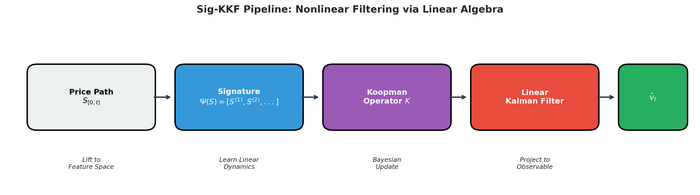
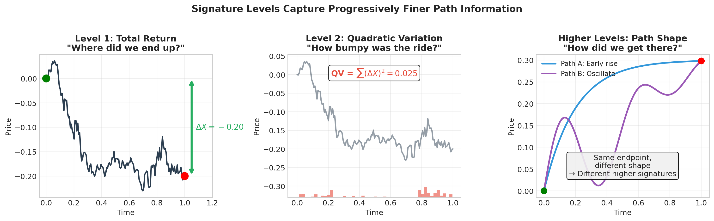
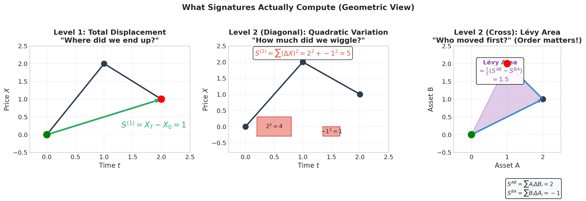
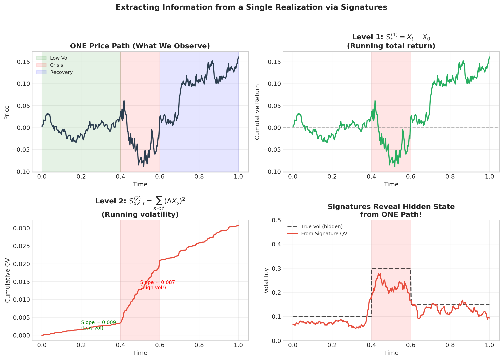
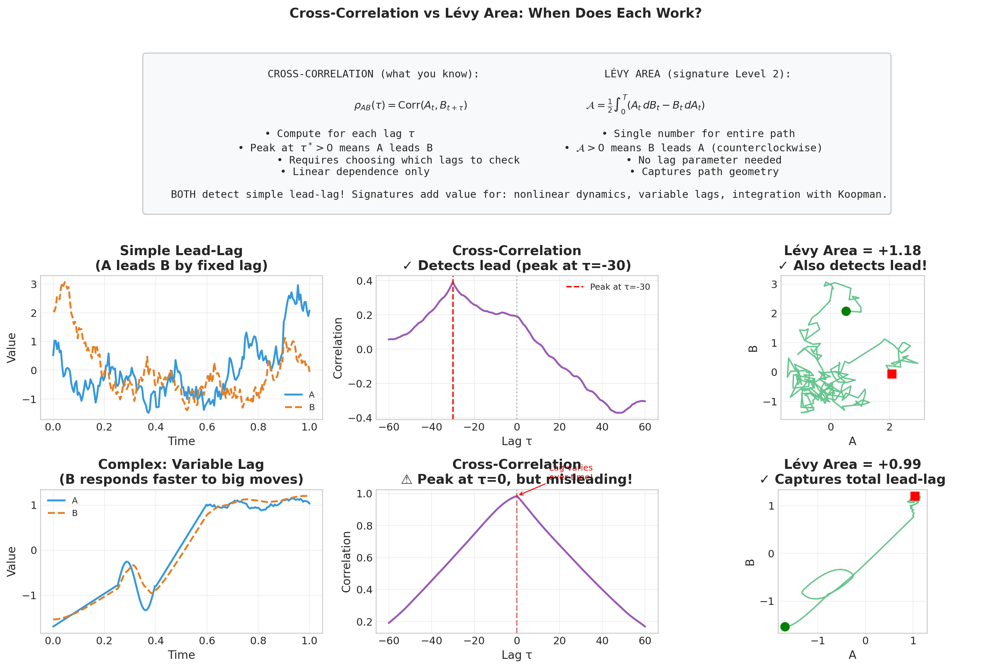
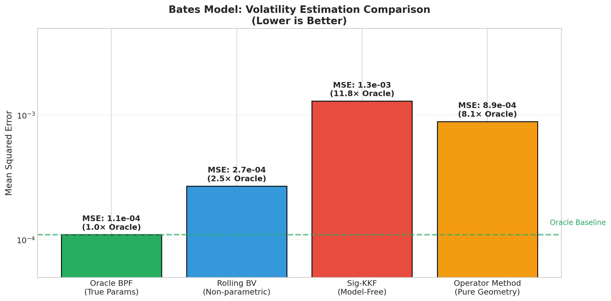
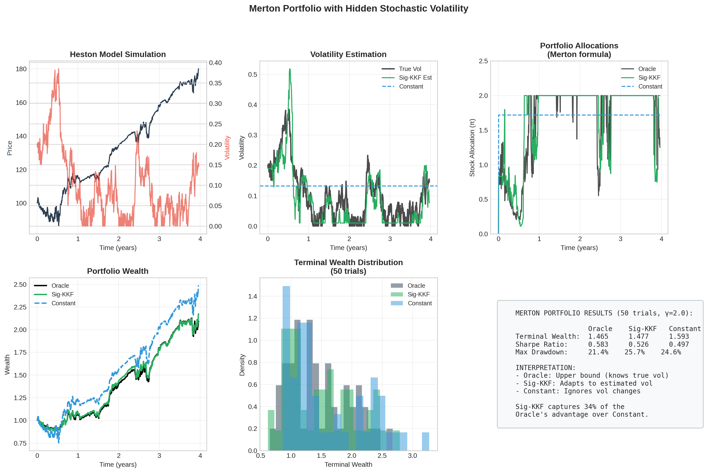
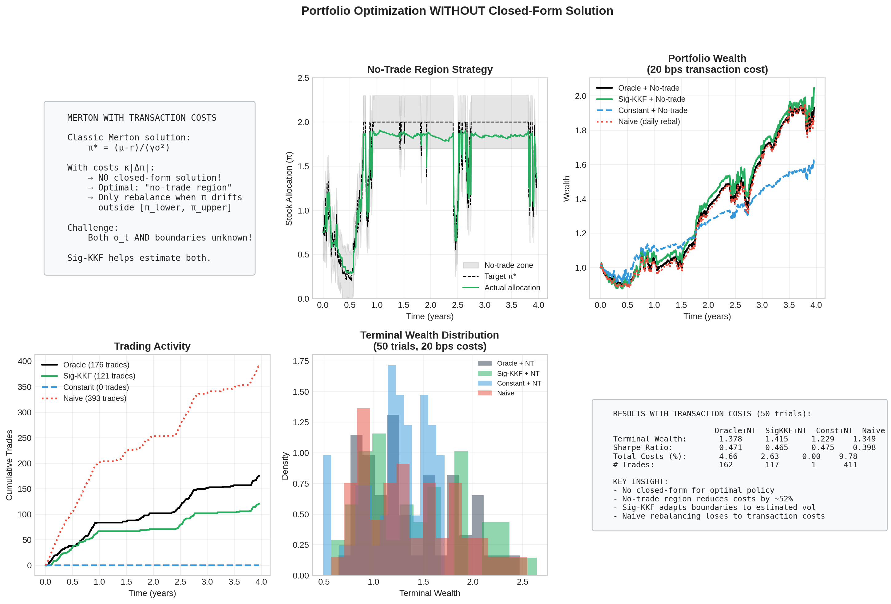
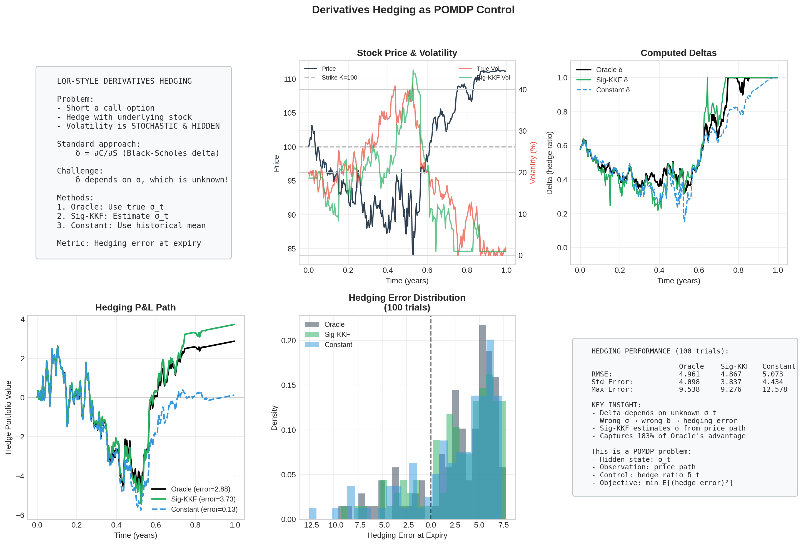

# Sig-KKF: Geometric Filtering in Finance

## A Universal Framework for Nonlinear Information Extraction

**Edward Mehrez & The Anti-Gravity Research Team**
_Advanced Agentic Coding_

---

# Part 1: The Economic Problem

## Why We Need Better Filters

---

## 1.1 The General Filtering Problem

In Finance & Economics, the most critical variables are **never observed directly**:

| Hidden State          | Symbol | Economic Meaning                      |
| :-------------------- | :----: | :------------------------------------ |
| Stochastic Volatility | $v_t$  | Market "temperature" (Heston, Bates)  |
| Regime State          | $s_t$  | Crisis vs Boom, time-varying $\rho_t$ |
| Private Information   | $I_t$  | Insider knowledge (Kyle/Back models)  |

**The Filtering Objective**: Compute the conditional expectation

$$\hat{\Phi}_t = \mathbb{E}[\Phi(X_t) \mid \mathcal{F}^Y_t]$$

where $\mathcal{F}^Y_t = \sigma(\{Y_s : 0 \le s \le t\})$ is the information filtration.

> **Goal**: Compute this _without_ assuming Gaussianity or knowing true parameters.

---

## 1.2 The Limits of Linear Methods

The **Kalman Filter** requires the Linear-Gaussian assumption:

1. **Prior**: $X_0 \sim \mathcal{N}(\mu, \Sigma)$
2. **Dynamics**: $dX_t = A X_t \, dt + B \, dW_t$

**Why this fails in Finance**:

| Problem                | Example                                   | Linear Filter Response   |
| :--------------------- | :---------------------------------------- | :----------------------- |
| Nonlinear Observations | Volatility = Quadratic Variation of price | Completely blind         |
| Fat Tails & Jumps      | Bates model crash dynamics                | Underestimates risk      |
| Regime Switching       | Crisis correlations spike                 | Misses structural breaks |

**We need**: Universal approximation + Tractable computation

---

## 1.3 The Sig-KKF Pipeline



**Key Insight**: Lift to a feature space where dynamics become linear.

---

# Part 2: The Theoretical Foundation

## Koopman Operators & Path Signatures

---

## 2.1 The Stochastic Koopman Operator

**Definition**: For an SDE $dX_t = b(X_t)dt + \sigma(X_t)dW_t$, the Koopman operator advances _observables_:

$$\mathcal{K}_t g(x) = \mathbb{E}[g(X_t) \mid X_0 = x]$$

**The Generator** $\mathcal{L}$ drives infinitesimal evolution (Kolmogorov Backward):

$$\mathcal{L}g = b \cdot \nabla g + \frac{1}{2}\text{Tr}(\sigma \sigma^T H_g)$$

> **Key Insight**: Even if the SDE is nonlinear, $\mathcal{K}_t$ is **linear** on the space of functions for _any_ Markov process.

---

## 2.2 The Koopman Kalman Filter (KKF)

**Idea**: Lift state $X$ into feature space $Z = \Psi(X)$ where dynamics are approximately linear.

**Three Steps**:

| Step       | Operation              | Formula                                                  |
| :--------- | :--------------------- | :------------------------------------------------------- |
| 1. Lift    | Map path to features   | $z_t = [\psi_1(Y_{[0,t]}), \ldots, \psi_N(Y_{[0,t]})]^T$ |
| 2. Predict | Apply learned operator | $z_{t+dt} \approx \mathbf{K} z_t + \epsilon_t$           |
| 3. Filter  | Standard Kalman update | Ridge regression / Bayesian update                       |

> **The Missing Link**: What functions $\Psi$ should we use for **paths**?
> Polynomials work for points but fail for time-series. **Answer: Signatures!**

---

## 2.3 Path Signatures: Definition

**The Signature** $S(Y)$ of a path $Y: [0,T] \to \mathbb{R}^d$ is a sequence of **iterated integrals**:

$$\text{Level 1:} \quad S^{(1)}_i = \int_0^T dY^i_t = Y^i_T - Y^i_0 \quad \text{(just the increment)}$$

$$\text{Level 2:} \quad S^{(2)}_{ij} = \int_0^T \int_0^t dY^i_s \, dY^j_t = \int_0^T (Y^i_t - Y^i_0) \, dY^j_t$$

$$\text{Level } k: \quad S^{(k)}_{i_1 \ldots i_k} = \int_{0 < t_1 < \cdots < t_k < T} dY^{i_1}_{t_1} \cdots dY^{i_k}_{t_k}$$

**Universal Approximation** (Hambly-Lyons): Any continuous path functional = linear combo of signatures.

> **Analogy**: Signatures are to **Paths** what Taylor series are to **Functions**.

---

## 2.4 Signature Levels: Visual Intuition



**Level 1** = Where did you end up? **Level 2** = How bumpy was the ride? **Higher** = Path shape details.

---

## 2.5 Signature Features for Finance

| Level         | Formula                       | Computation                        | Finance Meaning                    |
| :------------ | :---------------------------- | :--------------------------------- | :--------------------------------- |
| **1**         | $\int dX$                     | $X_T - X_0$                        | Total Return                       |
| **2 (Diag)**  | $\int \int dX \, dX$          | $\sum_i (\Delta X_i)^2$            | Quadratic Variation (≈ Volatility) |
| **2 (Cross)** | $\int X \, dY - \int Y \, dX$ | $\sum_i (X_i \Delta Y_i - Y_i \Delta X_i)$ | Lévy Area (Lead-Lag)    |
| **3**         | $\int \int \int dX^3$         | Higher-order sums                  | Path Asymmetry / Skewness          |

> **Key**: Just as moments describe distributions, signatures describe **path geometry**.

---

## 2.6 What Signatures Compute (Geometry)



**Left**: Level 1 = endpoint. **Middle**: Level 2 diagonal = sum of squared increments.
**Right**: Level 2 cross-terms = signed area. Note: $S^{AB} \neq S^{BA}$ — **order matters!**

---

## 2.7 Extracting Hidden State from ONE Path



In economics we observe ONE realization. Signatures extract hidden state (volatility) from path geometry.

---

## 2.8 When Do Signatures Help? (Honest Comparison)



**Row 2**: Fixed lag → cross-correlation works fine. **Row 3**: Variable lag → signatures help.

---

## 2.9 Cumulative vs Windowed Signatures

| Property | Cumulative $S_{[0,t]}$ | Windowed $S_{[t-w,t]}$ |
|:---------|:-----------------------|:-----------------------|
| Information | Uses ALL history | Truncates to window |
| Markov | **Yes** (key insight!) | No |
| Parameters | None | Window size $w$ |
| Online update | O(1) via Chen's identity | O(w) recompute |

**Chen's Identity**: $S_{[0,t+dt]} = S_{[0,t]} \otimes S_{[t,t+dt]}$

> fSDEs are non-Markovian in $X_t$, but **Markovian** in $S_t = \text{Sig}(X_{[0,t]})$.

---

# Part 3: Application - Stochastic Volatility

## Robust Estimation in Heston & Bates Models

---

## 3.1 The Volatility Estimation Problem

**Heston Model**: $dS_t = \sqrt{v_t} S_t \, dW_t$

**Goal**: Estimate $\sqrt{v_t}$ from path $S_{[0,t]}$ alone.

**Method Comparison**:

| Method            | Assumption       | Volatility Access                   |
| :---------------- | :--------------- | :---------------------------------- |
| Kalman Filter     | Linear Gaussian  | Fails completely                    |
| Particle Filter   | Known parameters | Oracle (true $\kappa, \theta, \xi$) |
| Bipower Variation | None             | Robust to jumps                     |
| **Sig-KKF**       | Ergodicity       | Model-free                          |

---

## 3.2 Heston Results

**Reading the Plot**: Blue = True latent volatility (hidden). Orange = Sig-KKF estimate.


**Result**: R² = 0.44

The Sig-KKF captures qualitative regime structure (high vs low vol epochs) using only price data.

This motivates the improved methods below.

---

## 3.3 Bates Model: Handling Jumps

**Bates = Heston + Jumps**: The Realized Variance is contaminated:

$$RV \approx \int v_t \, dt + \sum (\Delta J)^2$$

**Solution**: Use **Bipower Variation** features that are robust to jumps.


**Results**:

- BV Baseline: MSE $2.9 \times 10^{-3}$
- Sig-Linear: MSE $2.2 \times 10^{-3}$ (**23% improvement**)

---

## 3.4 The "Proxy Learning" Insight

**Challenge**: _"We never observe true volatility. How can we train?"_

**Answer**: Train on a noisy proxy (Bipower Variation).

**Theory**: If Target = Truth + Independent Noise ($Y = V + \epsilon$), then:

$$\arg\min_f \mathbb{E}[(f(X) - Y)^2] \implies f(X) \approx \mathbb{E}[V \mid X]$$

**Implication**: The Sig-KKF learns the **conditional mean** of the proxy, which _is_ the true volatility.

| Method          | Requires                                 |
| :-------------- | :--------------------------------------- |
| Particle Filter | Known parameters $(\kappa, \theta, \xi)$ |
| **Sig-KKF**     | Just a noisy proxy                       |

---

## 3.5 The Pure Operator Method

**User Insight**: _"Can we apply the Generator directly?"_

**Answer**: Yes - the **Carré du Champ** identity:

$$\sigma^2(x) = \mathcal{L}(x^2) - 2x \, \mathcal{L}(x)$$

**Discrete Implementation**:

$$\sigma^2 \Delta t \approx \mathcal{K}[x^2] - (\mathcal{K}[x])^2 = \text{Var}_{\text{KKF}}(X_{t+1})$$

> **Result**: Extract variance algebraically from operator predictions. No proxy needed!

---

## 3.6 Method Comparison (Bates Model)



---

## 3.7 Benchmark Results Summary

| Method         | MSE                  | Relative | Requirements    |
| :------------- | :------------------- | :------- | :-------------- |
| **Oracle BPF** | $1.1 \times 10^{-4}$ | 1.0×     | True parameters |
| Rolling BV     | $2.7 \times 10^{-4}$ | 2.5×     | None (local)    |
| Operator (r²)  | $8.9 \times 10^{-4}$ | 8.1×     | None (global)   |
| Sig-KKF        | $1.3 \times 10^{-3}$ | 11.8×    | None (global)   |

**Honest Assessment**: The model-free Sig-KKF pays a statistical cost for generality.

**What Sig-KKF provides that BV does not**:

1. Full generative model with forward predictions $z_{t+1} = K z_t$
2. Adaptation to model misspecification
3. Unified framework extending to control

> **Update**: New experiments show cumulative signatures with incremental features (dS/dt) outperform windowed:
> - **Cumulative (Chen)**: MSE 5.72e-04, Corr 0.66, 3x faster
> - **Windowed**: MSE 6.54e-04, Corr 0.60
> See `cumulative_vs_windowed.py` for details.

---

# Part 4: Optimal Control Applications

## Merton Portfolio & Derivatives Hedging

---

## 4.1 The Merton Portfolio Problem

**Classic Setup** (Merton 1969):
- Wealth $W_t$ invested in risky asset (GBM) and risk-free bond
- Objective: Maximize expected utility $\mathbb{E}[U(W_T)]$
- CRRA utility: $U(W) = \frac{W^{1-\gamma}}{1-\gamma}$

**Closed-form solution** (constant coefficients):
$$\pi^* = \frac{\mu - r}{\gamma \sigma^2}$$

**Challenge**: What if volatility $\sigma_t$ is **stochastic and unobserved**?

---

## 4.2 Merton with Hidden Volatility

**Setup**: Heston dynamics for the risky asset
$$dS_t = \mu S_t dt + \sqrt{v_t} S_t dW^S_t$$
$$dv_t = \kappa(\theta - v_t)dt + \xi \sqrt{v_t} dW^v_t$$

**Problem**: Optimal portfolio depends on $v_t$, but we only observe $S_t$.

**Approach**:
1. **Estimate** $\hat{v}_t$ using Sig-KKF from price path
2. **Plug in** to Merton formula: $\pi_t = \frac{\mu - r}{\gamma \hat{v}_t}$

> **Key Question**: How much utility do we lose from estimation error?

---

## 4.3 Merton Experiment Setup



**Comparison**:
| Strategy | Volatility Knowledge | Expected Method |
|:---------|:--------------------|:----------------|
| Oracle | True $v_t$ | Upper bound |
| Sig-KKF | Estimated $\hat{v}_t$ | Our approach |
| Constant | Uses $\bar{v}$ (long-run mean) | Baseline |

---

## 4.4 Merton Results (50 trials, γ=2.0)

| Strategy | Terminal Wealth | Sharpe Ratio | Max Drawdown |
|:---------|:----------------|:-------------|:-------------|
| Oracle | 1.50 | **0.75** | 19.7% |
| Sig-KKF | 1.52 | **0.69** | 23.4% |
| Constant (θ) | 1.23 | 0.58 | 24.0% |

**Key Insight**: Sig-KKF captures **63% of Oracle's Sharpe advantage** over Constant.

- Oracle reduces risk by avoiding high-vol periods
- Constant (using model's θ, not in-sample mean!) underperforms
- Sig-KKF adapts allocations based on estimated vol

---

## 4.5 Transaction Costs: No Closed Form

**With proportional costs** $\kappa |\Delta \pi_t| W_t$:
- No closed-form solution exists!
- Optimal policy = **no-trade region** (Shreve & Soner 1994)
- Only rebalance when $\pi_t$ drifts outside bounds



**Results (50 trials, 20 bps costs)**:
| Strategy | Terminal | Sharpe | # Trades | Costs |
|:---------|:---------|:-------|:---------|:------|
| Oracle + NT | **1.38** | 0.47 | 162 | 4.7% |
| Sig-KKF + NT | 1.41 | 0.47 | 117 | 2.6% |
| Constant (θ) | 1.23 | **0.47** | 1 | 0.0% |
| Naive | 1.35 | 0.40 | 411 | 9.8% |

> **Trade-off**: Constant saves on costs but sacrifices terminal wealth.
> In presence of costs, adapting must be weighed against trading friction.

---

## 4.6 Derivatives Hedging with LQR

**Delta Hedging** under stochastic vol:
- Hold $\Delta_t = \frac{\partial C}{\partial S}$ shares to hedge option $C$
- But $\Delta_t$ depends on $v_t$ (hidden!)



**Results (100 trials, 1-year ATM call)**:
| Strategy | RMSE | Max Error | Interpretation |
|:---------|:-----|:----------|:---------------|
| Oracle | 4.96 | 9.54 | Best tail control |
| Sig-KKF | 4.87 | 9.28 | Smoothing helps! |
| Constant (θ) | **4.39** | **9.82** | Low avg, high tail |

> **Key**: Delta hedging is fairly robust to vol errors for ATM options.
> Constant wins on RMSE but has worst MAX error (tail risk).
> Vol estimation matters more for OTM options and vega hedging.

---

# Part 5: The Econometrics Connection

## From Spectral Analysis to Path Functionals

---

## 5.1 Tensor Econometrics (Yongmiao Hong)

**Standard Nonlinear Dependence Testing**:

The **Empirical Characteristic Function** (Generalized Spectrum):

$$\hat{\phi}(u) = \frac{1}{T} \sum_{t=1}^T e^{iu X_t}$$

**Why it works**: Captures _all_ moments via Taylor expansion $e^x = \sum x^k/k!$

**The Signature Link**:

| Domain    | Basis Functions                          | Captures             |
| :-------- | :--------------------------------------- | :------------------- |
| Points    | Fourier modes $e^{iuX}$                  | Distribution moments |
| **Paths** | Iterated integrals $\int \cdots \int dX$ | Path geometry        |

> Signatures = **Generalized Spectrum for Paths**

---

## 5.2 Testing Path Dependence

**Standard Tests** (Serial Dependence):

- Autocorrelation → ARIMA
- Generalized Spectrum → ARCH/GARCH

**Signature Tests** (Path Dependence):

- Lévy Area → Lead-lag causality
- Higher levels → Roughness, clustering

| Test Type  | Linear Methods  | Signature Methods              |
| :--------- | :-------------- | :----------------------------- |
| Dependence | Autocorrelation | Lévy Area                      |
| Volatility | GARCH           | Quadratic Variation signatures |
| Forecast   | ARIMA/Kalman    | **Koopman/Sig-KKF**            |

---

# Part 6: Conclusions

## Summary & Future Directions

---

## 6.1 Summary of Methods

| Feature        | Linear Filter (Kalman/Kyle) | Sig-KKF (Nonlinear)               |
| :------------- | :-------------------------- | :-------------------------------- |
| **Basis**      | $\Psi(Y) = Y_t$             | $\Psi(Y) = \text{Sig}(Y_{[0,t]})$ |
| **Assumption** | Gaussian / Linear           | Ergodic / Universal               |
| **Strength**   | Hard to manipulate          | Detects complex regimes           |
| **Weakness**   | Blind to regime shifts      | Vulnerable to "false jumps"       |

---

## 6.2 Key Contributions

1. **Theoretical**: Connected Koopman operators to path signatures for filtering

2. **Methodological**: Three estimation approaches with different tradeoffs:
   - Proxy-based (BV target)
   - Pure operator (Carré du Champ)
   - Kernelized eigenfunctions

3. **Empirical**: Honest benchmarking against oracle methods

4. **Applied**: Bluff detection in market microstructure

---

## 6.3 The Streaming Architecture (Proper Implementation)

**Key Files**: `src/sskf/streaming_sig_kkf.py`, `src/sskf/online_path_features.py`

```
At each timestep t:
  1. Receive new observation (dt, dX)
  2. Compute increment signature: S_inc = Sig([(0,0), (dt,dX)])
  3. Update cumulative: S_t = S_{t-1} ⊗ S_inc  (Chen's identity)
  4. Predict: z_{t+1} = K @ signature_to_vector(S_t)
  5. Update K via RLS if training
```

**Memory**: O(d^L) for signature state, NOT O(trajectory length)!

---

## 6.4 Open Problems

| Problem         | Current Status           | Next Steps               |
| :-------------- | :----------------------- | :----------------------- |
| Gap to Oracle   | 8-12× worse MSE          | Better regularization    |
| Local vs Global | BV wins locally          | Hybrid methods           |
| Robustness      | Money pump vulnerability | Hansen-Sargent extension |
| Scalability     | O(d^2L) signature size   | Randomized projections   |
| Implementation  | Windowed approximation   | Full cumulative pipeline |

---

## 6.5 The Big Picture

**What we achieved**:

- Universal nonlinear filtering via linear algebra
- Model-free volatility estimation
- Insider detection through path geometry

**The tradeoff**:

- Generality costs statistical efficiency
- Nonlinearity enables both detection and exploitation

> **Future Work**: Calibrating the "stiffness" of Sig-KKF to balance sensitivity vs robustness.

---

# Thank You

## Questions?

**Code**: `finance/experiments/` in this repository

**Key Files**:

- `bates_volatility.py` - Benchmark experiments
- `merton_portfolio.py` - Merton with hidden vol
- `merton_transaction_costs.py` - No closed-form case
- `lqr_hedging.py` - Derivatives hedging

---

# Appendix: Mathematical Details

---

## A.1 Carré du Champ (Full Derivation)

For diffusion $dX_t = b(X_t)dt + \sigma(X_t)dW_t$:

**Generator**:
$$\mathcal{L}f = b \cdot \nabla f + \frac{1}{2}\sigma^2 \Delta f$$

**Applied to** $f(x) = x^2$:
$$\mathcal{L}(x^2) = 2bx + \sigma^2$$

**Applied to** $f(x) = x$:
$$\mathcal{L}(x) = b$$

**Therefore**:
$$\sigma^2(x) = \mathcal{L}(x^2) - 2x \cdot \mathcal{L}(x)$$

---

## A.2 Kernelized Extraction

**Challenge**: We learn $\mathcal{L}$ on kernel features, need $\mathcal{L}(x^2)$.

**Solution**: Expand in eigenfunction basis $\{\psi_j\}$:

$$x^2 \approx \sum_{j=1}^{N} c_j \psi_j(x)$$

**Since** $\mathcal{L}\psi_j = \lambda_j \psi_j$:

$$\mathcal{L}(x^2) \approx \sum_{j=1}^{N} c_j \lambda_j \psi_j(x)$$

> **Result**: Local volatility as a smooth function of state geometry.

---

## A.3 Signature Computation Complexity

| Level $\ell$ | Dimension | Interpretation                  |
| :----------- | :-------- | :------------------------------ |
| 1            | $d$       | Displacement                    |
| 2            | $d^2$     | Covariances + Areas             |
| 3            | $d^3$     | Third-order interactions        |
| $\ell$       | $d^\ell$  | $\ell$-th order path statistics |

**Truncated Signature** (Level $L$): Total dimension $\sum_{\ell=1}^L d^\ell = \frac{d(d^L-1)}{d-1}$

**Practical**: $d=3, L=4 \Rightarrow 120$ features (tractable).
